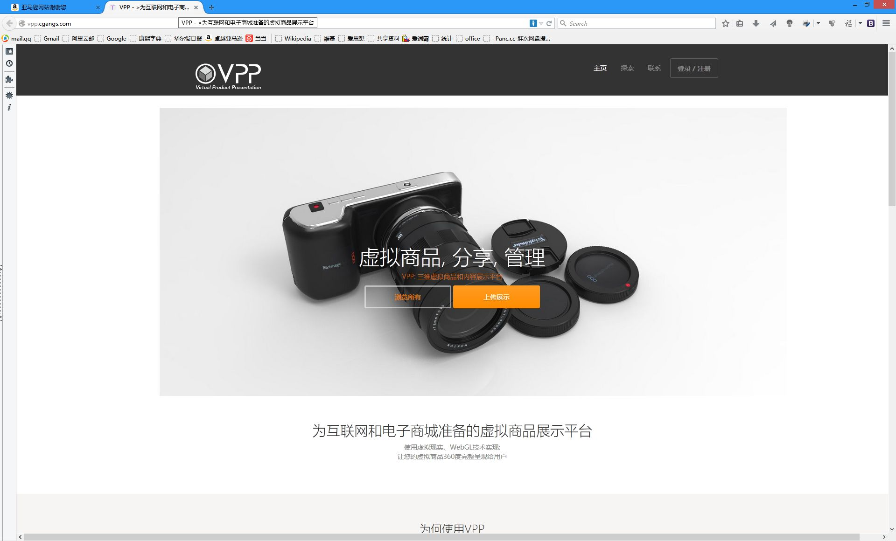

# VPP

Virtual Product Presentation Platforms for E-Commerce

为互联网和电子商城准备的虚拟商品展示平台

##  env

1. 安装python 2.7  版本不需要太高

2  安装django 1.7，首先安装setuptools，有时也要安装python-devel,安装setuptools时，如果报错没有zlib库，那就安装，之后重新编译python（提前编译好也就没有错误了），安好好要验证一下哦，import django

3  安装pil图形库，可以下载源码安装Imageing-1.1.7

4  安装mysql ,mysql-server,mysql-devel, MySQL-python 数据库模块，进python验证一下，import MySQLdb,如果实在安装不上就源码安装吧，之后要启动mysql否则用不了的，把它添加到开机启动，进入到mysql里面，建数据库，授权(与vpp/settings.py 里面的DARABASES下的一致即可)

5 安装缓存系统memcached (之前要安装libevent,网上资料很多)

6 安装six 源码下载安装，在运行的时候却什么包就安装相应的包。

6 服务器可选apache（centos自带），nginx(能够很好的处理高并发和反向代理)，无论选哪一个，安装，设置。Apache为例，作为本地服务器，要设置虚拟主机，目录，代理

7 设置开机启动 在VPP下写一shell脚本例如start.sh（python manage.py runserver 0.0.0.0:8000）,在/etc/rc.d/rc.local 里面加上要开机运行的脚本路径 （sh /var/www/VPP/start.sh）